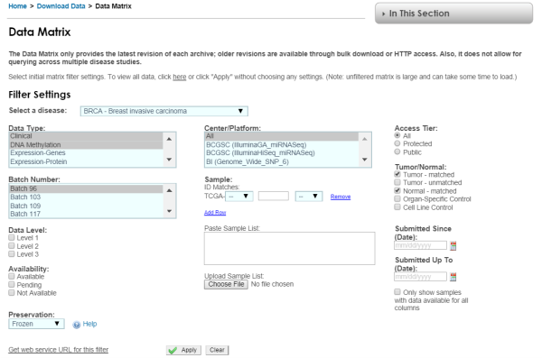
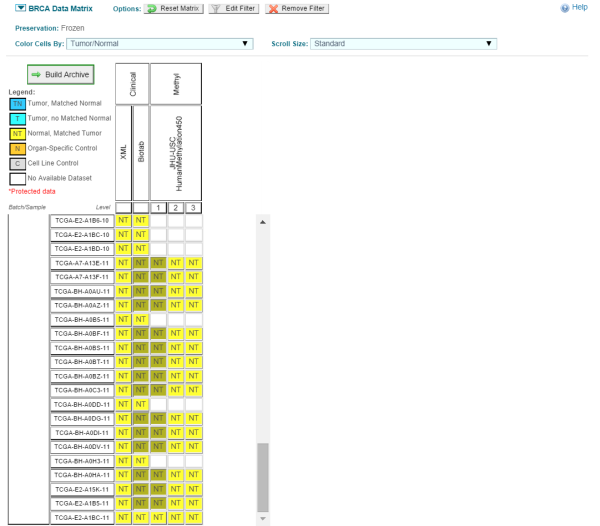
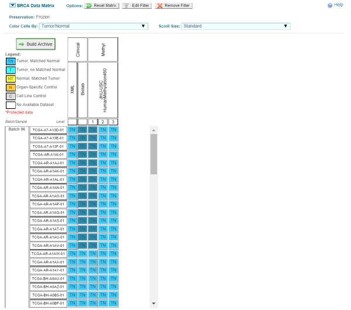
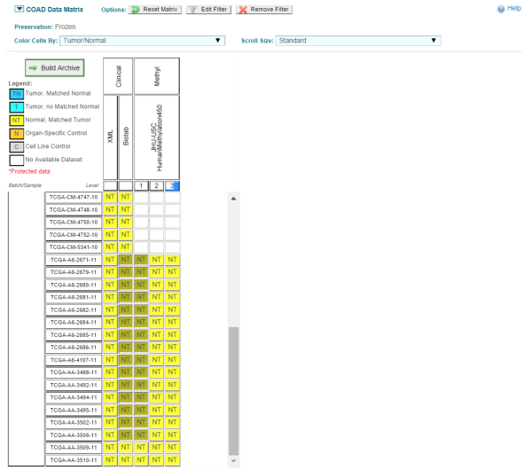
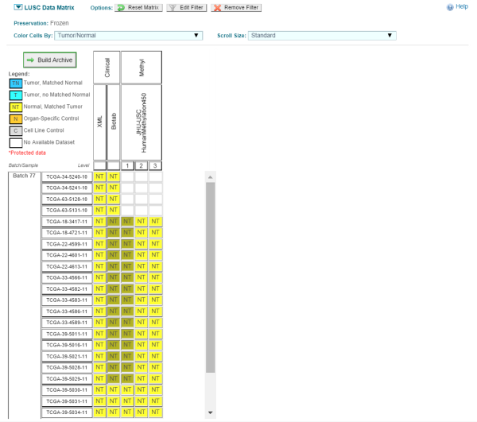

```{r setup, include=FALSE}
knitr::opts_chunk$set(echo = TRUE)
```

# Instructions for downloading methylation data:

When selecting the data, be sure to choose only the samples that end in 01 (TCGA-..-....-01) for solid tissue tumor types and samples that end in 11 (TCGA-..-....-11) for solid tissue normal types. For each cancer type, once the correct settings are selected, click the "Build Archive" button and then download the data. The settings used for the data matrix page and the specific TCGA samples chosen are shown in the following screenshots:

BRCA normal - Filter Settings  


BRCA normal - Samples   
       

BRCA tumor - Samples  
    

COAD normal - Filter Settings  
      

COAD normal - Samples  
  

LUSC normal - Filter Settings  
  

LUSC normal - Samples  
  

After unzipping the files that are sent to the email of your choice, save each cancer type (BRCA, COAD, LUSC) as different folders under a new directory, like "datadir" shown below. You will need to update the path to the files.

Load breast tumor and breast normal data:

```{r,eval=F}
library(minfi)
datadir <- "/Users/Morgan/Documents/methylation_files/breast"

clinicalDir <- file.path(datadir,"Clinical/Biotab")
sample_tab <- read.delim(file.path(clinicalDir,
  "nationwidechildrens.org_biospecimen_sample_brca.txt"),sep="\t",stringsAsFactors=FALSE)
keep <- sample_tab$sample_type %in% c("Primary Tumor", "Solid Tissue Normal")
sa mple_tab <- sample_tab[keep,]

patient_id <- unique(sapply(strsplit(sample_tab$bcr_sample_barcode,split="-"),
  function(x) paste(x[1:3],collapse="-")))

tumor_sample_id <- sample_tab$bcr_sample_uuid[sample_tab$sample_type=="Primary Tumor"]
normal_sample_id <- sample_tab$bcr_sample_uuid[sample_tab$sample_type=="Solid Tissue
  Normal"]

# read tumor data
tumor_tab <- read.delim(file.path(clinicalDir,
  "nationwidechildrens.org_biospecimen_tumor_sample_brca.txt"),sep="\t",
  stringsAsFactors=FALSE)

tab <- merge(sample_tab, tumor_tab, by="bcr_sample_uuid",
  suffixes=c(".sample",".tumor"),all.x=TRUE)

# read normal data
normal_tab <- read.delim(file.path(clinicalDir,
  "nationwidechildrens.org_biospecimen_normal_control_brca.txt"),sep="\t",
  stringsAsFactors=FALSE)
tab <- merge(tab, normal_tab, by="bcr_sample_uuid",
  suffixes=c(".tumor",".normal"),all.x=TRUE)

tab$bcr_patient_barcode <- tab$bcr_patient_barcode.tumor

ii <- is.na(tab$bcr_patient_barcode)
tab$bcr_patient_barcode[ii] <- tab$bcr_patient_barcode.normal[ii]

# read patient data
patient_tab <- read.delim(file.path(clinicalDir,
  "nationwidechildrens.org_clinical_patient_brca.txt"),sep="\t",stringsAsFactors=FALSE)
names(patient_tab) <- paste("patient",names(patient_tab),sep=".")
tmp <- merge(tab,patient_tab,by.x="bcr_patient_barcode",by.y=
  "patient.bcr_patient_barcode",all.x=TRUE,suffixes=c(".sample",".patient"))
tab <- tmp

# read meth metadata
methMetaDir <- file.path(datadir,"METADATA/JHU_USC__HumanMethylation450")
methMeta_tab <- read.delim(file.path(methMetaDir,
  "jhu-usc.edu_BRCA.HumanMethylation450.1.9.0.sdrf.txt"),sep="\t",stringsAsFactors=FALSE)

sample_barcode <- sapply(strsplit(methMeta_tab$Comment..TCGA.Barcode.,split="-"),
  function(x) paste(x[1:4],collapse="-"))
m <- match(tab$bcr_sample_barcode,sample_barcode)
tab$Basename <- gsub("_Grn\\.idat","",methMeta_tab$Array.Data.File[m])
tab <- tab[!is.na(tab$Basename),]

basedir <- file.path(datadir,"DNA_Methylation/JHU_USC__HumanMethylation450/Level_1")
tab$Basename <- file.path(basedir,tab$Basename)
keep <- file.exists(paste(tab$Basename,"_Grn.idat",sep=""))
breast_targets <- tab
objs <- grep("tab",ls(),value=TRUE)
rm(list=objs)
objs <- grep("dir",ls(),value=TRUE,ignore=TRUE)
rm(list=objs)

nms <- names(breast_targets)
targets.breast <- breast_targets[nms]

targets.breast$Status <- factor(ifelse(targets.breast$sample_type==
  "Primary Tumor","cancer","normal"),levels=c("normal","cancer"))
targets.breast$Tissue <- tolower(targets.breast$patient.tumor_tissue_site)
targets.breast$Sex <- targets.breast$patient.gender
```

Load colon normal data:

```{r,eval=F}
datadir <- "/Users/Morgan/Documents/methylation_files/colon"

clinicalDir <- file.path(datadir,"Clinical/Biotab")
sample_tab <- read.delim(file.path(clinicalDir,
  "nationwidechildrens.org_biospecimen_sample_coad.txt"),sep="\t",stringsAsFactors=FALSE)
keep <- sample_tab$sample_type %in% c("Primary Tumor", "Solid Tissue Normal")
sample_tab <- sample_tab[keep,]

patient_id <- unique(sapply(strsplit(sample_tab$bcr_sample_barcode,split="-"),
  function(x) paste(x[1:3],collapse="-")))

tumor_sample_id <- sample_tab$bcr_sample_uuid[sample_tab$sample_type=="Primary Tumor"]
normal_sample_id <- sample_tab$bcr_sample_uuid[sample_tab$sample_type==
  "Solid Tissue Normal"]

# read tumor data
tumor_tab <- read.delim(file.path(clinicalDir,
  "nationwidechildrens.org_biospecimen_tumor_sample_coad.txt"),sep="\t",
  stringsAsFactors=FALSE)

tab <- merge(sample_tab, tumor_tab, by="bcr_sample_uuid",
  suffixes=c(".sample",".tumor"),all.x=TRUE)

# read normal data
normal_tab <- read.delim(file.path(clinicalDir,
  "nationwidechildrens.org_biospecimen_normal_control_coad.txt"),sep="\t",
  stringsAsFactors=FALSE)
tab <- merge(tab, normal_tab, by="bcr_sample_uuid",
  suffixes=c(".tumor",".normal"),all.x=TRUE)

tab$bcr_patient_barcode <- tab$bcr_patient_barcode.tumor

ii <- is.na(tab$bcr_patient_barcode)
tab$bcr_patient_barcode[ii] <- tab$bcr_patient_barcode.normal[ii]

# read patient data
patient_tab <- read.delim(file.path(clinicalDir,
  "nationwidechildrens.org_clinical_patient_coad.txt"),sep="\t",stringsAsFactors=FALSE)
names(patient_tab) <- paste("patient",names(patient_tab),sep=".")
tmp <- merge(tab,patient_tab,by.x="bcr_patient_barcode",by.y=
  "patient.bcr_patient_barcode",all.x=TRUE,suffixes=c(".sample",".patient"))
tab <- tmp

# read meth metadata
methMetaDir <- file.path(datadir,"METADATA/JHU_USC__HumanMethylation450")
methMeta_tab <- read.delim(file.path(methMetaDir,
  "jhu-usc.edu_COAD.HumanMethylation450.1.9.0.sdrf.txt"),sep="\t",stringsAsFactors=FALSE)

sample_barcode <- sapply(strsplit(methMeta_tab$Comment..TCGA.Barcode.,split="-"),
  function(x) paste(x[1:4],collapse="-"))
m <- match(tab$bcr_sample_barcode,sample_barcode)
tab$Basename <- gsub("_Grn\\.idat","",methMeta_tab$Array.Data.File[m])
tab <- tab[!is.na(tab$Basename),]

basedir <- file.path(datadir,"DNA_Methylation/JHU_USC__HumanMethylation450/Level_1")
tab$Basename <- file.path(basedir,tab$Basename)
keep <- file.exists(paste(tab$Basename,"_Grn.idat",sep=""))
colon_targets <- tab
objs <- grep("tab",ls(),value=TRUE)
rm(list=objs)
objs <- grep("dir",ls(),value=TRUE,ignore=TRUE)
rm(list=objs)

nms <- names(colon_targets)
targets.colon <- colon_targets[nms]

targets.colon$Status <- factor(ifelse(targets.colon$sample_type==
  "Primary Tumor","cancer","normal"),levels=c("normal","cancer"))
targets.colon$Tissue <- tolower(targets.colon$patient.tumor_tissue_site)
targets.colon$Sex <- targets.colon$patient.gender
```

Load lung normal data:

```{r,eval=F}
datadir <- "/Users/Morgan/Documents/methylation_files/lung"


clinicalDir <- file.path(datadir,"Clinical/Biotab")
sample_tab <- read.delim(file.path(clinicalDir,
  "nationwidechildrens.org_biospecimen_sample_lusc.txt"),sep="\t",stringsAsFactors=FALSE)
keep <- sample_tab$sample_type %in% c("Primary Tumor", "Solid Tissue Normal")
sample_tab <- sample_tab[keep,]

patient_id <- unique(sapply(strsplit(sample_tab$bcr_sample_barcode,split="-"),
  function(x) paste(x[1:3],collapse="-")))

tumor_sample_id <- sample_tab$bcr_sample_uuid[sample_tab$sample_type=="Primary Tumor"]
normal_sample_id <- sample_tab$bcr_sample_uuid[sample_tab$sample_type==
  "Solid Tissue Normal"]

# read tumor data
tumor_tab <- read.delim(file.path(clinicalDir,
  "nationwidechildrens.org_biospecimen_tumor_sample_lusc.txt"),sep="\t",
  stringsAsFactors=FALSE)

tab <- merge(sample_tab, tumor_tab, by="bcr_sample_uuid",
  suffixes=c(".sample",".tumor"),all.x=TRUE)

# read normal data
normal_tab <- read.delim(file.path(clinicalDir,
  "nationwidechildrens.org_biospecimen_normal_control_lusc.txt"),sep="\t",
  stringsAsFactors=FALSE)
tab <- merge(tab, normal_tab, by="bcr_sample_uuid",
  suffixes=c(".tumor",".normal"),all.x=TRUE)

tab$bcr_patient_barcode <- tab$bcr_patient_barcode.tumor

ii <- is.na(tab$bcr_patient_barcode)
tab$bcr_patient_barcode[ii] <- tab$bcr_patient_barcode.normal[ii]

# read patient data
patient_tab <- read.delim(file.path(clinicalDir,
  "nationwidechildrens.org_clinical_patient_lusc.txt"),sep="\t",stringsAsFactors=FALSE)
names(patient_tab) <- paste("patient",names(patient_tab),sep=".")
tmp <- merge(tab,patient_tab,by.x="bcr_patient_barcode",by.y=
  "patient.bcr_patient_barcode",all.x=TRUE,suffixes=c(".sample",".patient"))
tab <- tmp

# read meth metadata
methMetaDir <- file.path(datadir,"METADATA/JHU_USC__HumanMethylation450")
methMeta_tab <- read.delim(file.path(methMetaDir,
  "jhu-usc.edu_LUSC.HumanMethylation450.1.7.0.sdrf.txt"),sep="\t",stringsAsFactors=FALSE)

sample_barcode <- sapply(strsplit(methMeta_tab$Comment..TCGA.Barcode.,split="-"),
  function(x) paste(x[1:4],collapse="-"))
m <- match(tab$bcr_sample_barcode,sample_barcode)
tab$Basename <- gsub("_Grn\\.idat","",methMeta_tab$Array.Data.File[m])
tab <- tab[!is.na(tab$Basename),]

basedir <- file.path(datadir,"DNA_Methylation/JHU_USC__HumanMethylation450/Level_1")
tab$Basename <- file.path(basedir,tab$Basename)
keep <- file.exists(paste(tab$Basename,"_Grn.idat",sep=""))
lung_targets <- tab
objs <- grep("tab",ls(),value=TRUE)
rm(list=objs)
objs <- grep("dir",ls(),value=TRUE,ignore=TRUE)
rm(list=objs)

nms <- names(lung_targets)
targets.lung <- lung_targets[nms]

targets.lung$Status <- factor(ifelse(targets.lung$sample_type==
  "Primary Tumor","cancer","normal"),levels=c("normal","cancer"))
targets.lung$Tissue <- tolower(targets.lung$patient.tumor_tissue_site)
targets.lung$Sex <- targets.lung$patient.gender

rm(list=ls()[!(ls() %in% c('targets.breast','targets.colon','targets.lung'))])
```

Merge and read methylation data.

```{r,eval=F,message=F,results="hide"}
merge <- merge(targets.breast,targets.colon,all=TRUE)
targets <- merge(merge,targets.lung,all=TRUE)
targets <- targets[which(file.exists(paste0(targets$Basename,"_Grn.idat"))),]

memory.limit(size=10000)
rg_set <- read.metharray(targets$Basename,verbose=TRUE)
pData(rg.set) <- targets

table(targets$Tissue,targets$Status)
```

# Preprocessing

We now have an RGChannelSet that was created from reading the downloaded IDAT files. Next, the data needs to be processed into usable objects for various functions in the minfi package to work properly. The object classes to be used are the RGChannelSet, MethylSet, GenomicMethylSet, RatioSet, or GenomicRatioSet, which all represent different forms of information from the 450k experiment. Most of the analysis will be done on the GenomicRatioSet datatype. To preprocess the data minfi's variety of preprocess...() functions are used to convert the data sets into usable R objects.

Data Input             | Processing Function    | Output           | Analytic Use
---------------------- | ---------------------- | ---------------- | --------------------------
Raw data (IDAT files)  | read.metharray()        | RGChannelSet     | output of reading data   
RGChannelSet           | preprocessIllumina()   | MethylSet        | dmpFinder method
MethylSet              | mapToGenome()          | GenomicMethylSet | blockFinder method
GenomicMethylSet       | ratioConvert()         | GenomicRatioSet  | bumphunter method

These steps make a GenomicRatioSet out of an RGChannelSet.

```{r,eval=F,results="hide"}
memory.limit(size=10000)
methset <- preprocessIllumina(rg_set)
gen_methset <- mapToGenome(methset)
gen_ratset <- ratioConvert(gen_methset,type="Illumina")
```

# Subsetting

Finally, we subset the last two objects to chromosomes 10, 11 and 20 for the purposes of this workshop.

```{r, eval=FALSE}
gr <- granges(gen_methset)
keep <- seqnames(gr) %in% c("chr10", "chr11", "chr20")
gen_methset_small <- gen_methset[keep,]

gr <- granges(gen_ratset)
keep <- seqnames(gr) %in% c("chr10", "chr11", "chr20")
gen_ratset_small <- get_ratset[keep,]
```

These are the objects available in this workshop pacakge.
